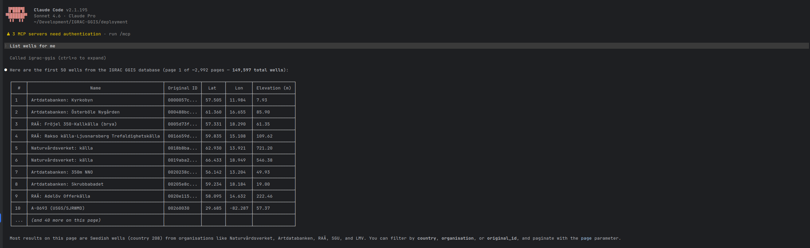
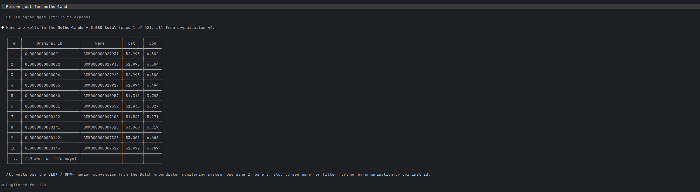
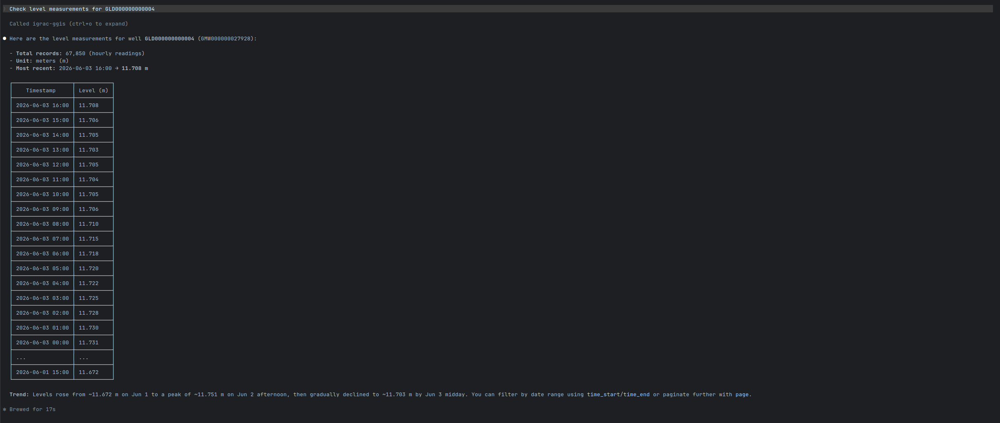
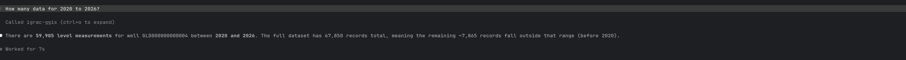
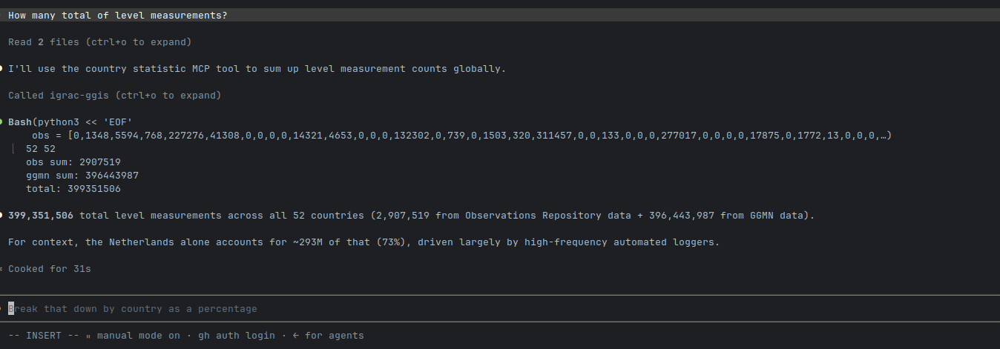
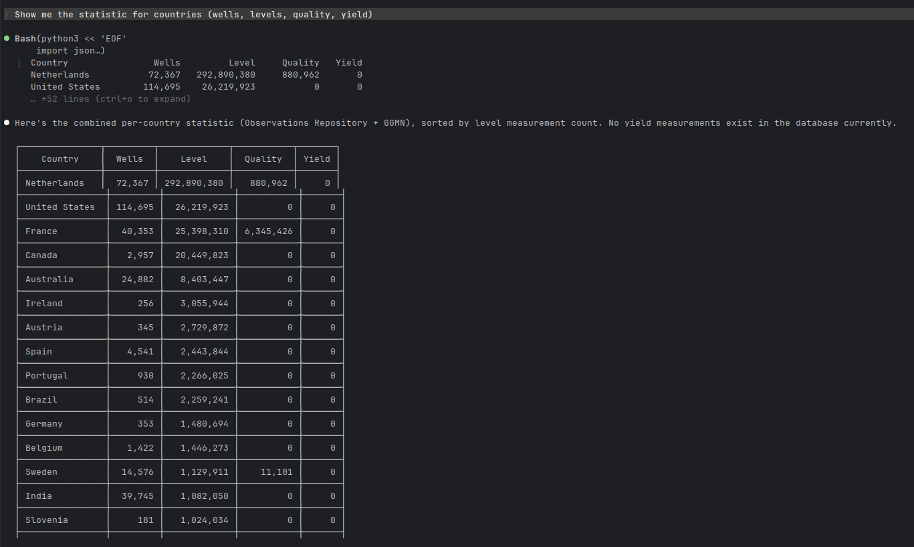
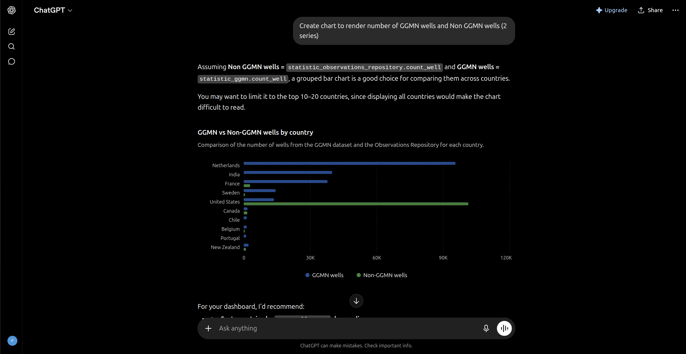

# IGRAC GGIS — AI Assistant Integration

## What is MCP?

**MCP (Model Context Protocol)** is a technology that connects AI assistants — such as Claude — directly to live databases and systems. Rather than manually searching through a platform, users can simply ask questions in plain language and receive instant, accurate answers drawn from real data.

Think of it as giving your AI assistant direct access to IGRAC GGIS, so it can look things up, filter results, and explain findings — all within a natural conversation.

**Example:**
> *"Show me all groundwater wells in the Netherlands with measurements from 2020 to 2026"*

The AI handles the query, retrieves the data, and presents a clear summary — no technical knowledge required.

---

## What Can It Do?

The IGRAC GGIS AI integration allows users to explore groundwater data conversationally:

- **Find wells** — search and filter wells by country, organisation, or identifier across the entire global database
- **Explore measurements** — retrieve water level, quality, and yield readings for any well, with optional date range and value filters
- **Browse datasets** — discover and inspect published GeoNode datasets, including their spatial coverage and available formats

---

## Examples

### Finding Wells Globally

A simple request to list wells returns the full inventory with location and elevation data — **149,597 wells** worldwide, paginated and easy to explore.

---

### Filtering by Country

Asking for wells in a specific country instantly narrows the results. Here, filtering for the **Netherlands** returns **3,080 wells** from the Dutch groundwater monitoring network.

---

### Checking Water Level Measurements

For any well, the AI can pull up its full measurement history. Well **GLD000000000004** has **67,850 hourly level readings**, with the most recent showing 11.708 m.

---

### Querying a Specific Time Period

Users can ask how much data exists within a date range. For the same well, there are **59,985 measurements between 2020 and 2026** — answered in seconds without opening any report or spreadsheet.

---

### Totaling Measurements Across the Globe

Users can also ask for aggregate totals — for example, the total number of groundwater level measurements recorded across every country in the database, summed in seconds from cached per-country statistics.

---

### Country-by-Country Breakdown

Users can also request a full breakdown per country — wells, and level, quality, and yield measurement counts — combining Observations Repository and GGMN data in one table.

---

## Open API for GWML2 GGIS

Alongside the AI integration, we are also developing a **public Open API** for IGRAC GGIS. This will allow developers, researchers, and partner organisations to access groundwater data programmatically — directly from their own applications, scripts, or dashboards — without going through the web interface.

---

## What We Plan to Build Next

This integration is in its early stages. The following capabilities are on the roadmap:

### Deeper Data Access
- Full well profiles — drilling history, geology, aquifer type, and construction details
- Cross-country and regional comparisons in a single query
- Spatial search — find all wells within a geographic area

### Smarter Queries
- Trend detection — automatically identify wells with rising or declining water levels
- Anomaly alerts — flag unusual readings without manual inspection
- Summary reports — generate a country overview on demand

### Broader Dataset Support
- Access to all published GeoNode datasets, including maps and spatial layers
- Download links and OGC service connections surfaced through conversation

### Easier Access for Everyone
- Natural language queries that chain multiple steps automatically
- No login or technical setup required for read-only exploration
- Potential integration with web portals and reporting workflows

### Secure, Permission-Aware Access
- OAuth-based sign-in for the connector, so the AI assistant acts as the signed-in user instead of an anonymous read-only client
- Enforce the same GeoNode data permissions users already have — private or restricted datasets stay hidden unless the user is authorised to see them

---

## How to Connect — It's Easy

No coding, installation, or API keys needed. Connecting your AI assistant to IGRAC GGIS is just a few clicks using a **connector** — a built-in feature of AI assistant apps (such as Claude) that lets them talk to external systems like MCP servers.

1. Open your AI assistant's settings and find the **Connectors** (or "MCP servers") section.
2. Click **Add connector** / **Add custom connector**.
3. Paste in the IGRAC GGIS MCP server address, given to you by your administrator, and save.
4. That's it — start a new conversation and ask a question about wells, measurements, or datasets. The assistant will use the connector automatically whenever it needs live data.

Because the connection is read-only and requires no login, anyone can set it up in under a minute — there's nothing to install and nothing that can be broken by asking a question.

> **Coming soon:** OAuth sign-in for the connector, so the assistant respects each user's GeoNode data permissions and can safely surface non-public datasets to the people authorised to see them.

---

## Works With Any MCP-Compatible Assistant

The integration isn't tied to one app. Since it's built on the open MCP standard, the same connector works in **ChatGPT**, **Grok**, and **Perplexity** just as well as Claude — connect it once and ask the same natural-language questions.

- **Grok**: supports custom MCP connectors via "Bring Your Own MCP" (grok.com/connectors → New Connector → Custom), available on paid Grok tiers.
- **Perplexity**: supports custom remote MCP connectors (paste a server URL, choose OAuth/API key/none) on Pro, Max, and Enterprise plans.
- *Google Gemini isn't included yet — its consumer app doesn't support adding custom MCP connectors at this time.*
- *Microsoft Copilot isn't included yet either — MCP support currently lives in Copilot Studio / Microsoft 365 Copilot (business/enterprise tooling), not the everyday consumer Copilot app.*

---

## Does This Require a Subscription?

The IGRAC GGIS connector itself is **free** — there's no fee from IGRAC/GGIS to connect or query data. Whether *you* need a paid plan depends on which AI assistant you use, since that's a limit set by Claude or ChatGPT, not by GGIS:

- **Claude**: Free-plan users can already add **one** custom connector, so a single person can try IGRAC GGIS at no cost. Paid plans (Pro, Max, Team, Enterprise) allow multiple connectors alongside higher usage limits.
- **ChatGPT**: Custom MCP connectors require a **Plus** plan or higher (Plus, Pro, Business, Enterprise, Edu) with Developer Mode enabled — the Free tier doesn't support them at all.
- **Grok**: Custom MCP connectors ("Bring Your Own MCP") are part of Grok's connector feature; full, reliable access is tied to a paid **SuperGrok** tier.
- **Perplexity**: Custom remote connectors require **Pro** or higher — not available on the Free tier.

### Free vs. Paid, in short
| Assistant | Free | Paid |
|---|---|---|
| Claude | 1 custom connector, standard usage limits | Multiple connectors, higher usage limits, priority access to new features |
| ChatGPT | No connector support | Connector support (read-only on Plus/Pro; read/write on Business/Enterprise/Edu — not that it matters here, since IGRAC GGIS only ever exposes read-only data) |
| Grok | Limited/unreliable connector access | Full custom MCP connector access on SuperGrok tiers |
| Perplexity | No connector support | Custom connector support on Pro, Max, and Enterprise |

### Indicative Pricing (as of July 2026)
| Plan | Price (in dollar)                  |
|---|------------------------------------|
| Claude Pro | 20/month                           |
| Claude Max | 100–200/month                      |
| Claude Team | 20–100/seat/month (annual billing) |
| ChatGPT Plus | 20/month                           |
| ChatGPT Pro | 100 or 200/month                   |
| SuperGrok | 30/month (~25/month billed annually) |
| SuperGrok Heavy | 300/month                          |
| Perplexity Pro | 20/month                           |
| Perplexity Max | 200/month                          |

Prices change over time — check [claude.com/pricing](https://claude.com/pricing) or [chatgpt.com/pricing](https://chatgpt.com/pricing) for the current rates.

**Important:** any subscription is between you and Anthropic/OpenAI for *your own* AI account — IGRAC GGIS does not sell, require, or manage any subscription. Once the connector is added, anyone using their own Claude or ChatGPT account (free or paid) can start asking it questions about GGIS data.