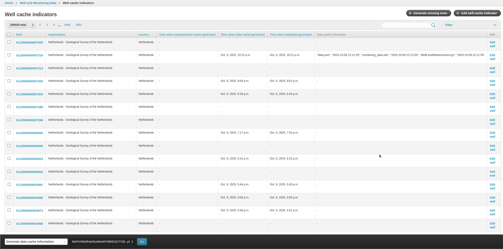
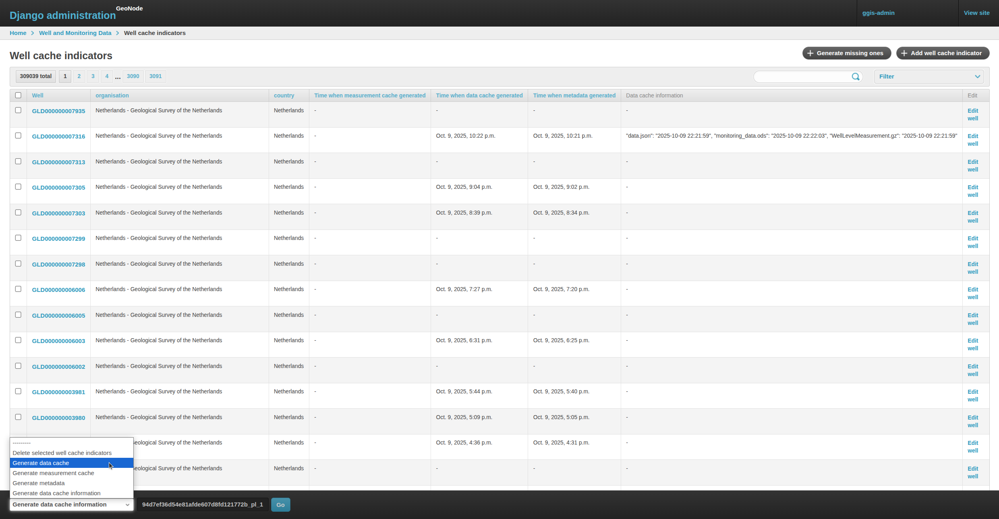
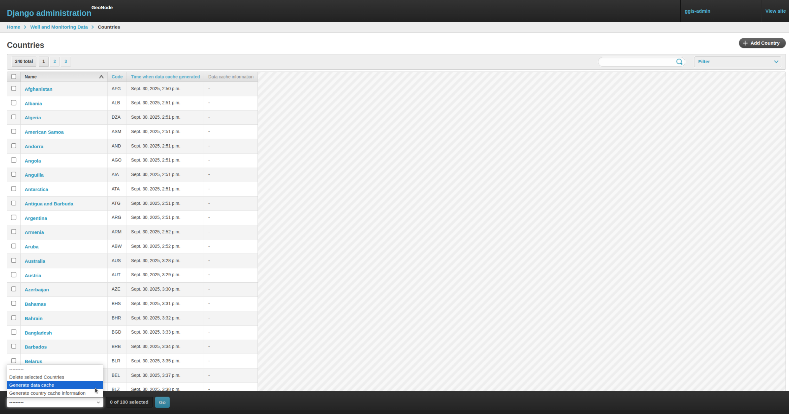
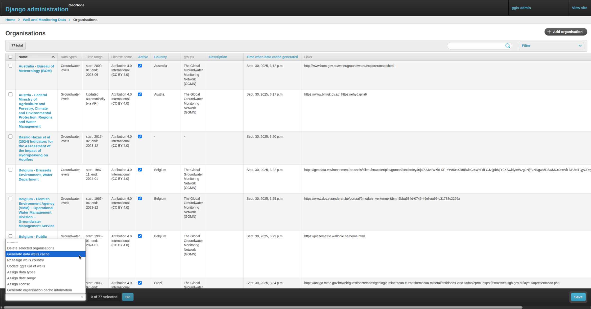

# Cache Management

## Overview

The IGRAC system uses several cache types to improve performance and reduce load times. Caching allows data such as wells, countries, and organisations to be served quickly to users.

However, cache generation can be time-consuming and may occasionally fail, leading to outdated or missing data. To address this, clients can manually trigger cache generation directly via the Django Admin interface.

 

## Cache Types and Purpose

 

| **Cache Category**     | **Cache Type**        | **Description**                                                                                     |
| ---------------------- | --------------------- | --------------------------------------------------------------------------------------------------- |
| **Well Cache**         | *Measurement Cache* | Stores measurement data for generating well graphs quickly.                                         |
|                        | *Data Cache*        | Contains downloadable well data files (e.g., `.ods` format).                                        |
|                        | *Metadata Cache*    | Holds metadata such as the number of measurements, types of wells, and related summary information. |
| **Country Cache**      | *Data Cache*        | Zipped file containing data cache of wells for a specific country.                                  |
| **Organisation Cache** | *Data Cache*        | Zipped file containing data cache of wells for a specific organisation.                             |

 

## Django Admin

All cache types can be viewed and managed through the **Django Admin Interface**.

Cache generation can be triggered manually, allowing users to refresh their own data caches without waiting for automated background jobs or developer intervention.

 

### Well Cache

**URL:** [Well Cache Admin](https://ggis.un-igrac.org/en-us/admin/gwml2/wellcacheindicator/)

 

Each well cache record includes:

- **`Time when measurement cache generated`**
    
    Timestamp when the measurement cache was last created.

     

- **`Time when data cache generated`**

    Timestamp when the data cache was last created.

     

- **`Time when metadata generated`**

    Timestamp when the metadata cache was last created.

     

- **`Data cache information`**

    Timestamp of the actual cache file creation, used to verify that all cache files are properly generated.

 

 

**To generate a cache:**

1. Select one or more wells from the list.

2. From the dropdown at the bottom-left, select **`Generate data cache`**.

3. Click **Go**.

 

 

### Country Cache

**URL:** [Country Cache Admin](https://ggis.un-igrac.org/en-us/admin/gwml2/country/)

 

Each country record includes:

- **`Time when data cache generated`**
    
    Timestamp when the data cache was last created.

     

- **`Data cache information`**

    Timestamp of the corresponding cache file creation.

 

**To generate a cache:**

1. Select one or more countries from the list.

2. From the dropdown at the bottom-left, select **`Generate data cache`**.

3. Click **Go**.

 

 

### Organisation Cache

**URL:** [Organisation Cache Admin](https://ggis.un-igrac.org/en-us/admin/gwml2/country/)

 

Each organisation record includes:

- **`Time when data cache generated`**
    
    Timestamp when the data cache was last created.

     

- **`Data cache information`**

    Timestamp of the cache file creation.

 

**To generate a cache:**

1. Select one or more organisations from the list.

2. From the dropdown at the bottom-left, select **`Generate data cache`**.

3. Click **Go**.

 

 

The IGRAC cache system improves data delivery efficiency by pre-generating downloadable files and metadata. Manual cache regeneration empowers clients to refresh outdated caches, ensuring up-to-date and reliable data access without waiting for scheduled background updates.

 
