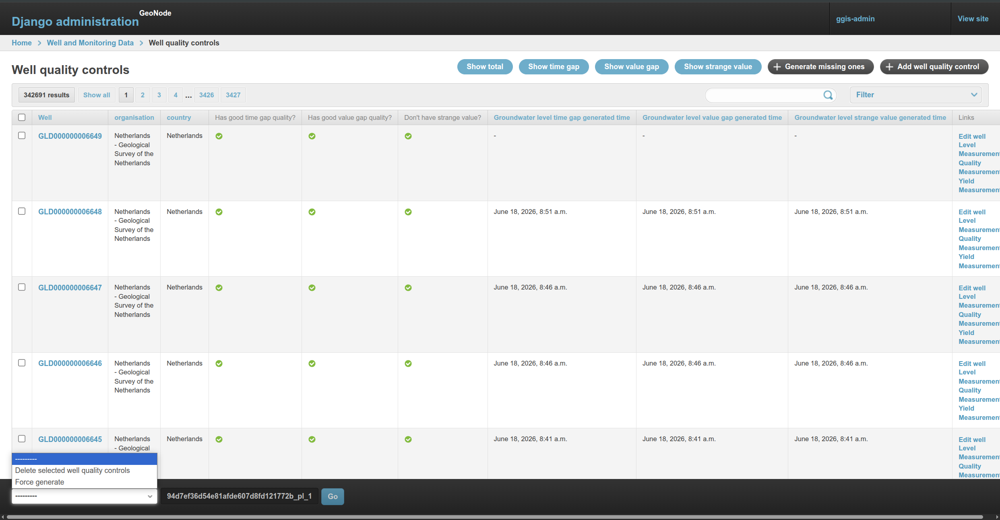

# Quality Control

> 🚀 Introduced in `gwml2 v4.12.4` — [August 13, 2025](https://github.com/kartoza/IGRAC-WellAndMonitoringDatabase/releases/tag/4.12.4)

Well quality control is implemented via the `WellQualityControl` model in
[`gwml2/models/well_quality_control.py`](https://github.com/kartoza/IGRAC-GGIS/blob/main/django_project/gwml2/models/well_quality_control.py). Each well has a one-to-one
`WellQualityControl` record that is created automatically when a new `Well` is
saved (via a `post_save` signal).

Calling `WellQualityControl.run()` executes all three checks sequentially.
Each check is skipped if it has already been run (its `_generated_time` field
is already set), so repeated calls are safe and cheap.

---

## Model Fields

| Field | Type | Description |
|---|---|---|
| `groundwater_level_time_gap` | JSON | Measurement pairs where the time gap exceeds the configured threshold |
| `groundwater_level_time_gap_generated_time` | DateTime | Timestamp of last time-gap check |
| `groundwater_level_value_gap` | JSON | Measurement pairs where the level jump exceeds the configured threshold |
| `groundwater_level_value_gap_generated_time` | DateTime | Timestamp of last level-gap check |
| `groundwater_level_strange_value` | JSON | Measurements matching the strange-value SQL filter |
| `groundwater_level_strange_value_generated_time` | DateTime | Timestamp of last strange-value check |

---

## Time Gap Check

**Method:** `gap_time_quality()` — [`well_quality_control.py:60`](https://github.com/kartoza/IGRAC-GGIS/blob/main/django_project/gwml2/models/well_quality_control.py#L60)

Finds the longest gap in days between consecutive level measurements using a
`LAG()` window function over `well_level_measurement`, partitioned by
`well_id` and `parameter_id`. If the largest gap meets or exceeds the threshold,
the result is saved to `groundwater_level_time_gap`.

**Result shape (JSON):**

```json
{
  "parameter_id": 1,
  "current": "2024-01-15 00:00:00",
  "previous": "2021-01-01 00:00:00",
  "gap": 1110.0
}
```

**Threshold:** `SitePreference.groundwater_level_quality_control_days_gap`
— configurable via Site Preferences, default **1095 days**.

---

## Level Gap Check

**Method:** `gap_level_quality()` — [`well_quality_control.py:92`](https://github.com/kartoza/IGRAC-GGIS/blob/main/django_project/gwml2/models/well_quality_control.py#L92)

Finds the largest jump in `value_in_m` between consecutive level measurements
using a `LAG()` window function, ordered by time. If the largest jump meets or
exceeds the threshold, the result is saved to `groundwater_level_value_gap`.

**Result shape (JSON):**

```json
{
  "parameter_id": 1,
  "time": "2023-06-01 00:00:00",
  "current": 45.2,
  "previous": -5.1,
  "gap": 50.3
}
```

**Threshold:** `SitePreference.groundwater_level_quality_control_level_gap`
— configurable via Site Preferences, default **50 metres**.

---

## Strange Value Check

**Method:** `strange_value_quality()` — [`well_quality_control.py:124`](https://github.com/kartoza/IGRAC-GGIS/blob/main/django_project/gwml2/models/well_quality_control.py#L124)

Queries `well_level_measurement` using a raw SQL `WHERE` clause from
`SitePreference.groundwater_level_strange_value_filter`. All matching rows
are saved to `groundwater_level_strange_value`.

**Result shape (JSON — list):**

```json
[
  { "parameter_id": 1, "time": "2022-03-10 00:00:00", "value": 0 },
  { "parameter_id": 1, "time": "2020-11-05 00:00:00", "value": -9999 }
]
```

**Filter:** `SitePreference.groundwater_level_strange_value_filter`
— configurable via Site Preferences, default `value_in_m IN (0, -9999)`.

---

## Site Preferences

All thresholds and filters are configured in the Django admin under
**Site Preferences** ([`gwml2/models/site_preference.py`](https://github.com/kartoza/IGRAC-GGIS/blob/main/django_project/gwml2/models/site_preference.py)):

| Preference | Default | Description |
|---|---|---|
| `groundwater_level_quality_control_days_gap` | `1095` | Max allowed gap in days between measurements |
| `groundwater_level_quality_control_level_gap` | `50` | Max allowed jump in metres between measurements |
| `groundwater_level_strange_value_filter` | `value_in_m IN (0, -9999)` | PostgreSQL `WHERE` fragment to match erroneous values |

---

## Running Quality Control

### Automatic

Quality control runs automatically in two situations:

- **On well creation** — a `post_save` signal ([`well_quality_control.py:146`](https://github.com/kartoza/IGRAC-GGIS/blob/main/django_project/gwml2/models/well_quality_control.py#L146)) creates a `WellQualityControl` record for every new `Well`.
- **Via Celery task** — the `run_well_quality_control` task ([`tasks/well_quality_control.py`](https://github.com/kartoza/IGRAC-GGIS/blob/main/django_project/gwml2/tasks/well_quality_control.py)) runs on the `update` queue and triggers the management command internally.

### Management Command

```bash
python manage.py generate_well_quality_control
python manage.py generate_well_quality_control --ids 123,456 --force
```

Use `--force` to re-run checks even if they have already been generated.

### Admin Action

In the Django admin, go to **Gwml2 → Well Quality Controls**, select one or more wells, then choose **Force generate** from the actions dropdown.



### Programmatically

```python
from gwml2.models.well_quality_control import WellQualityControl  # well_quality_control.py

qc = WellQualityControl.objects.get(well_id=<well_id>)
qc.run()
```