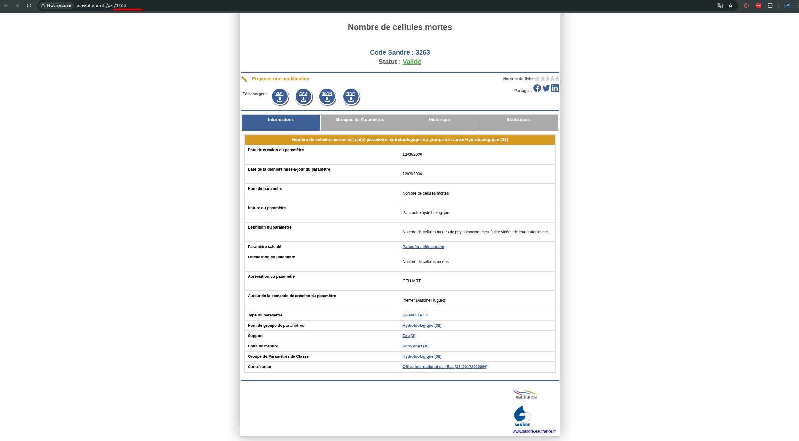
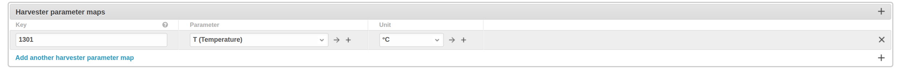

# Hubeau

**HUBEAU** is a harvester used to collect groundwater data  
from [https://hubeau.eaufrance.fr/api/v1/](https://hubeau.eaufrance.fr/api/v1/).  
The data is categorized into three types: **Water Level**, **Water Quality**

---

## Water Level

Water level data can be referenced from Hubeaus’s API page:  
👉 [
`https://hubeau.eaufrance.fr/api/v1/niveaux_nappes/`](https://hubeau.eaufrance.fr/api/v1/niveaux_nappes/)

### Getting Stations

The list of wells to be fetched is available via this API:  
👉 [
`https://hubeau.eaufrance.fr/api/v1/niveaux_nappes/stations`](https://hubeau.eaufrance.fr/api/v1/niveaux_nappes/stations)

### Getting Measurements for Each Well

Use the following API endpoint to fetch water level data for a specific
station:

```http
https://hubeau.eaufrance.fr/api/v1/niveaux_nappes/chroniques?code_bss={{station_id}}
```

**Important Fields:**

* `date_mesure` → Date of measurement
* `niveau_nappe_eau` → Groundwater level (in meters above sea level)

---

## Water Quality

Water quality data can be accessed via Hubeau’s API:
👉 [https://hubeau.eaufrance.fr/api/v1/qualite\_nappes/](https://hubeau.eaufrance.fr/api/v1/qualite_nappes/)

### Getting Stations

The list of wells (stations) can be retrieved using the following endpoint:
👉 [https://hubeau.eaufrance.fr/api/v1/qualite\_nappes/stations](https://hubeau.eaufrance.fr/api/v1/qualite_nappes/stations)

### Getting Measurements for Each Well

To obtain water quality measurements, you need to map the parameter code (
`code_param`) to your specific parameters.

You can explore the list of parameter codes here:
👉 [http://id.eaufrance.fr/par/1316#tabs-arbre](http://id.eaufrance.fr/par/1316#tabs-arbre)
Find the parameter you need, click on it, and copy the `code_param` from the
URL as shown below:



After identifying the parameter, map it accordingly as shown:



Use the following endpoint to fetch measurement data for a specific well:

```http
https://hubeau.eaufrance.fr/api/v1/qualite_nappes/analyses?bss_id={{station_id}}&code_param={{code_param}}
```

**Important Fields:**

* `date_debut_prelevement` → Measurement date
* `resultat` → Measured value