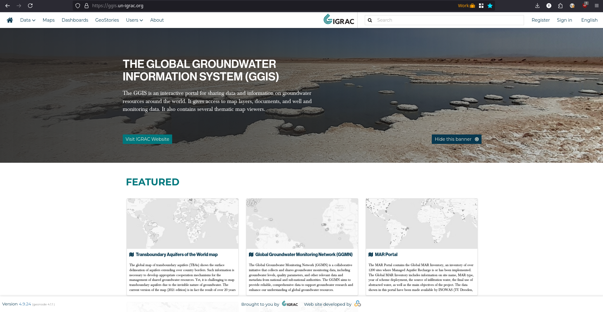

# The Global Groundwater Information System (GGIS)

GGIS is a groundwater information system developed for and funded by UN-IGRAC. The GGIS is an interactive portal for sharing data and information on groundwater resources around the world. It gives access to map layers, documents, and well and monitoring data. It also contains several thematic map viewers.

You can visit the live site here: https://ggis.un-igrac.org