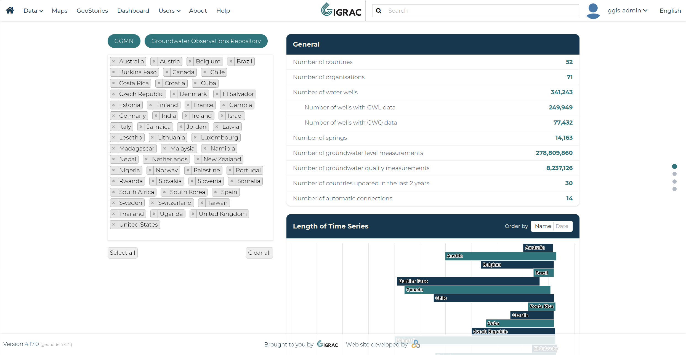
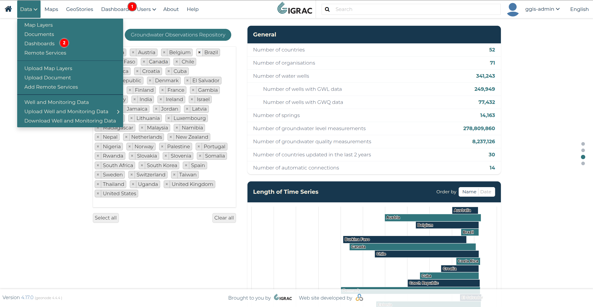
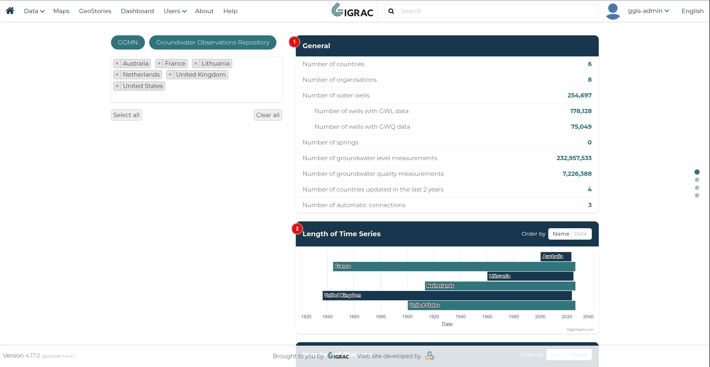
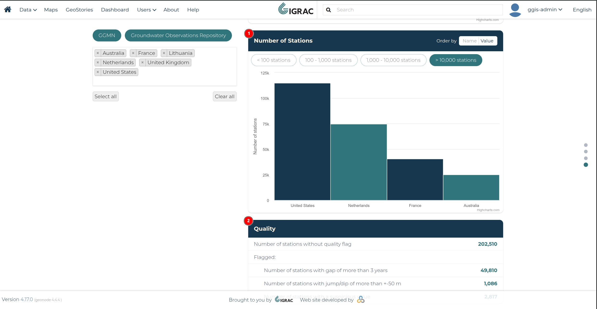
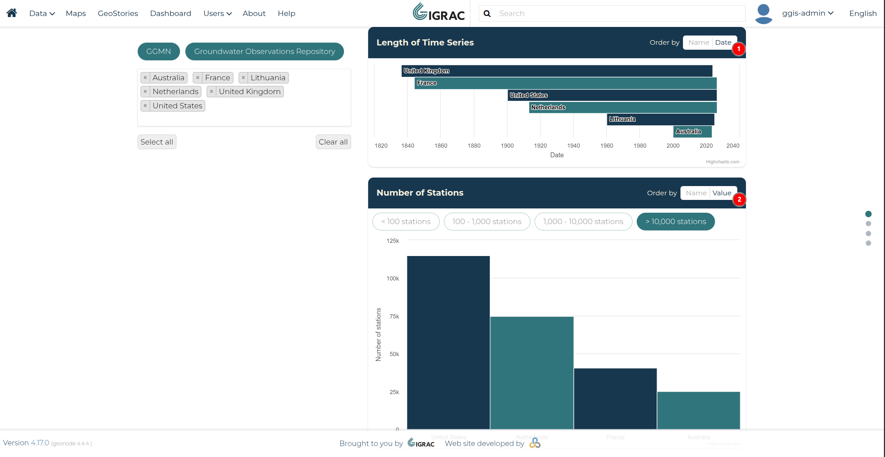
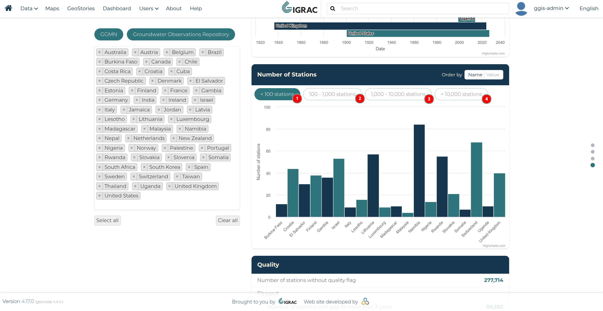
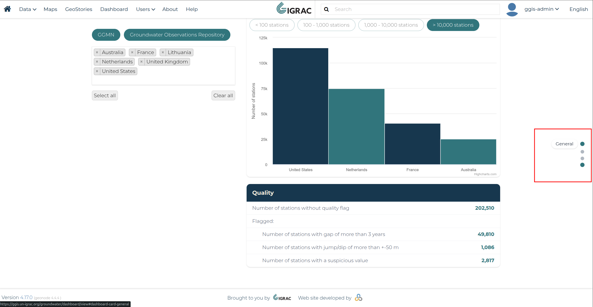
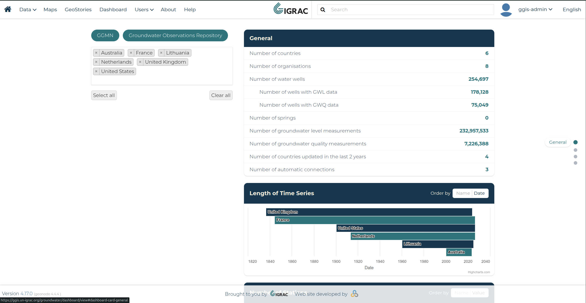
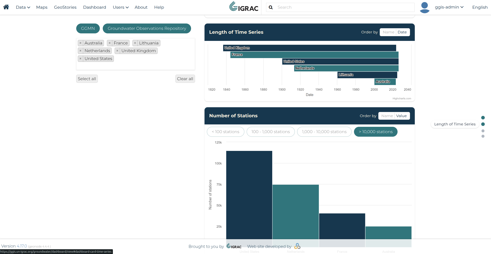
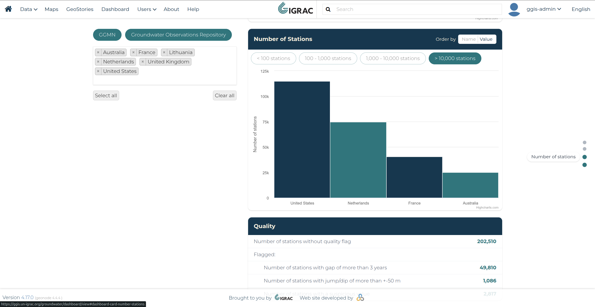

# Stations Dashboard

## What is the Dashboard?

The **Stations Dashboard** gives a summarised, statistical view of the groundwater monitoring data available in GGIS. Rather than browsing individual wells on the map, the dashboard aggregates the data across countries and organisations so you can quickly see how much data exists, how far back it goes, and how good its quality is.

## Accessing the Dashboard

The Stations Dashboard can be accessed directly from **Dashboard** in the navbar (1). Note that GeoNode's original **Dashboards** menu has been moved under **Data ▸ Dashboards** (2).

## Dashboard Content

The **General** card (1) shows the headline totals for the currently selected data, such as the number of countries, organisations, water wells, springs, and groundwater level/quality measurements. Below it, the **Length of Time Series** card (2) shows, per country, the date range over which groundwater level data has been collected.

Further down, the **Number of Stations** card (1) shows how many monitoring stations each country has, grouped into ranges you can switch between (e.g. fewer than 100, or more than 10,000 stations). Finally, the **Quality** card (2) shows how many stations carry a quality flag, such as a data gap of more than 3 years, a jump/dip of more than ±50 m, or a suspicious value.

## Sorting the Charts

The **Length of Time Series** (1) and **Number of Stations** (2) charts can each be reordered using the **Order by** control in their header. Choosing **Name** sorts the countries alphabetically, while choosing **Date** (for Length of Time Series) or **Value** (for Number of Stations) sorts them by their chart value instead.

## Filtering by Number of Stations

The **Number of Stations** chart can also be filtered by station count, using the range buttons above it: fewer than 100 stations (1), 100–1,000 stations (2), 1,000–10,000 stations (3), or more than 10,000 stations (4). Only countries falling within the selected range are shown in the chart.

## Jump Navigation

A sticky jump navigation panel is available on the right edge of the screen. Hovering over a dot reveals the label of the card it links to, and clicking it scrolls the page straight to that card.

Clicking any of the dots jumps straight to its corresponding section — **General**, **Length of Time Series**, **Number of Stations**, or **Quality** — without needing to scroll manually. As you scroll, the dot for the card currently in view is also highlighted, so the panel always shows which section you're looking at.