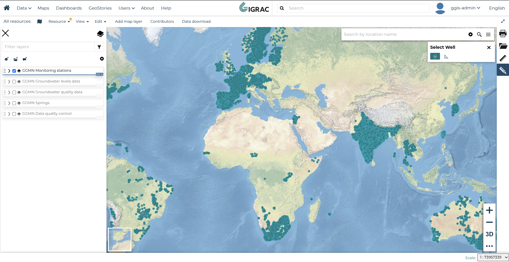
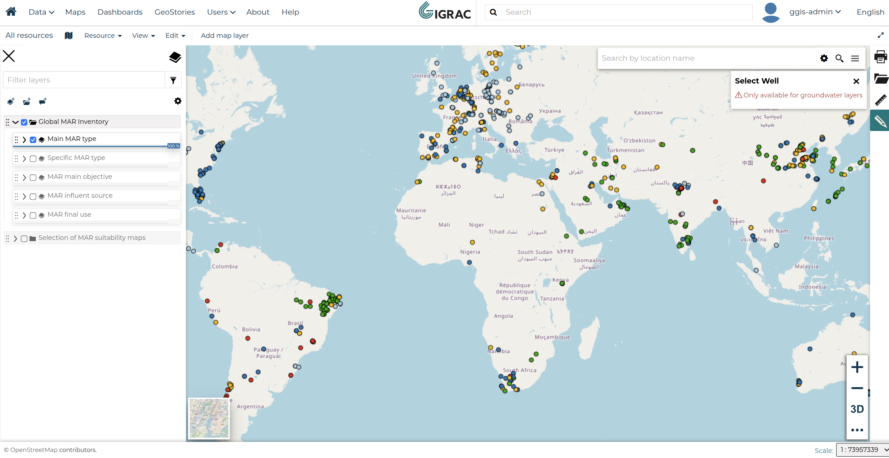

# How to Download Wells by Selecting on the Map

This tutorial explains how to select wells directly on the map and download their data. You can select individual wells using a point click or select multiple wells at once by drawing a polygon.

!!! note
    The **Select Well** tool is only available when a groundwater layer (e.g. GGMN Monitoring stations) is active. It will not work on other layer types.

---

## Opening the Select Well Panel

Make sure you have a groundwater layer active in the layer panel. Then open the **Select Well** panel from the map toolbar.

The panel shows two selection modes at the bottom:

- **Point** (circle icon) — click a single location on the map to select wells at that point
- **Polygon** (shape icon) — draw a polygon on the map to select all wells within the area

---

## Groundwater Layers Only

If you open the **Select Well** panel while a non-groundwater layer is active, you will see the following warning:

Switch to a groundwater layer in the layer panel before using the selection tools.

---

## Selecting Wells and Downloading

1. **Selection tools** — choose point or polygon mode, then click or draw on the map to select wells
2. **Selection list** — each selection appears with its type and the number of wells found (e.g. *Polygon 3 – 974 wells*)
3. **Remove selections** — click **✕** next to any entry to remove it individually, or click **Clear all** to remove all selections at once
4. **Navigation** — use the previous and next buttons to browse through the selected wells one by one
5. **Search by original ID** — filter the selected wells by their original identifier
6. **Download button** — click to download the data for all currently selected wells

!!! note
    Wells are displayed one at a time rather than all at once. This is because each well renders a graph of its measurements, and loading many graphs simultaneously can significantly slow down the browser.

You can combine multiple point and polygon selections before downloading. The total wells from all selections will be included in the download.

---

## Download Page

After clicking the download button, you will be redirected to the **Data Download** page.

The page shows the number of wells selected and asks you to fill in your user information before the download begins. Once all fields are filled in, click the **Download** button to start the download.

---

## Generating Process

After submitting the form, the system will start preparing your file. You will see a confirmation page showing your request details and a status message.

The page shows a summary of your request (data type, email, organisation, country, and data scope) while the file is being generated. Please wait until the process is complete.

---

## Download Ready

Once the file is ready, the page will update and display a download link.

Click the link to download your file as a `.zip` archive. The archive will contain the following data if available for the selected wells:

- **Well and Monitoring Data**
- **GGMN Data**